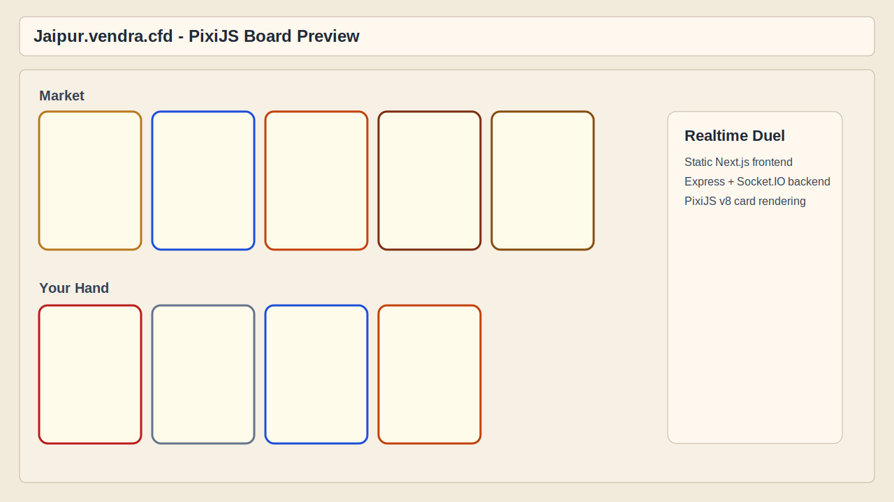

# Jaipur Browser Game

Refactored to:

- `Next.js` static frontend (exported site)
- `Node.js + Express` backend
- `Socket.IO` realtime multiplayer
- `PixiJS` canvas rendering for cards/board

## Live Preview

- URL: https://jaipur.vendra.cfd
- Repo preview image:



## Stack

- `next@15.5.2` (static export)
- `pixi.js@8.13.2`
- `express`, `socket.io`, `express-session`, `pg`

## Local Development

1. Install dependencies:

```bash
npm install
```

2. Run PostgreSQL (or use docker compose):

```bash
docker compose up -d db
```

3. Build frontend static output:

```bash
npm run build:frontend
```

4. Start backend server:

```bash
npm run dev
```

App default: `http://localhost:8080`

## Full Container Run

```bash
docker compose up -d --build
```

App default: `http://localhost:8087`

## Notes on Refactor

- Express now serves static files from `frontend/out`.
- `/join/:id` resolves to the same static entry and joins via client-side socket flow.
- Card rendering was migrated from DOM cards to PixiJS graphics-based cards.
- Audio cues were upgraded from single-tone beeps to short layered envelopes for clearer feedback.
